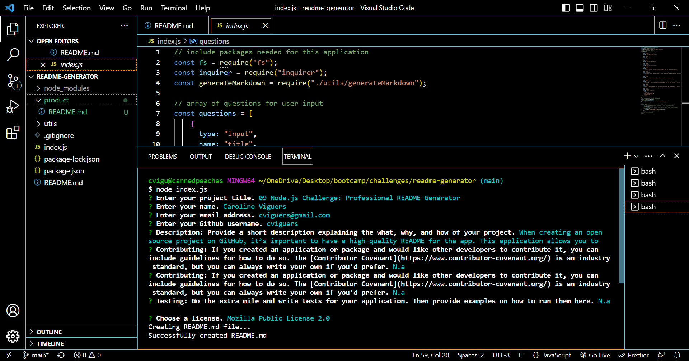
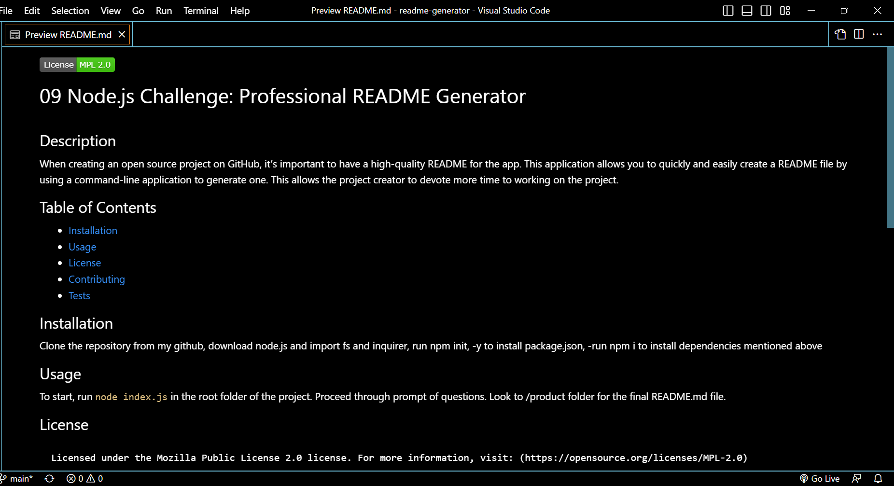

# 09 Node.js Challenge: Professional README Generator

## Description

When creating an open source project on GitHub, it’s important to have a high-quality README for the app. This application allows you to quickly and easily create a README file by using a command-line application to generate one. This allows the project creator to devote more time to working on the project.

## Table of Contents

- [Installation](#installation)
- [Usage](#usage)
- [License](#license)
- [Contributing](#contributing)
- [Tests](#tests)

## Installation

Clone the repository from my github, download node.js and import fs and inquirer, run npm init, -y to install package.json, -run npm i inquirer@8.2.4 to install dependencies inquirer.

## Usage

To start, run `node index.js` in the root folder of the project. Proceed through prompt of questions. Look to /product folder for the final README.md file. For a walkthrough video, visit: https://drive.google.com/file/d/1089sSwDW8NUjYQFHj5IQiGJrHMupzh8Z/view

## License

Licensed under the MIT license. For more information, visit: https://opensource.org/licenses/MIT

## Questions

If you have any additional questions, please contact me at cviguers@gmail.com or https://github.com/cviguers
